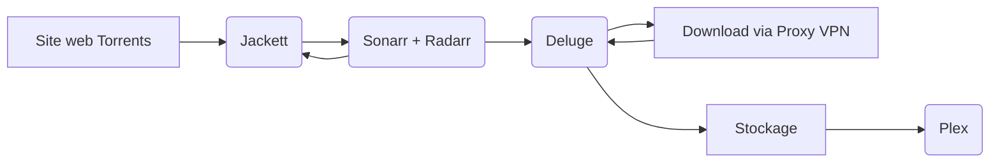

# **Docker-BandJ**

**Présentation du projet Docker de déploiement d'une plateforme multimédia automatisée.**

 - Lien GitHub : https://github.com/WaliWalou/docker-bandj
 - Lien DockerHub : https://hub.docker.com/repositories/benibee33

***Disclaimer*** *: ce projet n'a pas pour but d'encourager ou d'inciter au piratage audiovisuel. Ce premier entre dans un cadre éducatif et d'apprentissage visant à utiliser Docker plus en profondeur avec le déploiement d'une infrastructure automatisée de plusieurs conteneurs interconnectés.*

Liste des conteneurs :
- **Plex** : Gestionnaire de bibliothèques films / séries.
- **Jackett** : Proxy et indexeur de liens Torrents.
- **Radarr** : Planificateur de téléchargement de films.
- **Sonarr** : Planificateur de téléchargement de séries.
- **Deluge** : Client open-source et léger de téléchargement Torrents.

*// Extra*
- **Tautulli** : Monitoring, stats et graphs pour Plex.
- **Portainer** : Gestionnaire de containers Docker.

Les conteneurs communiquent entre eux via un réseau interne bridge, l'accès aux interfaces web doit se faire depuis l'hôte Docker.

-----------------

Le schéma suivant met en évidence le fonctionnement entre les 5 services principaux et leurs liaisons :

**Jackett** va jouer le rôle de source destinées aux requêtes des plateformes **Sonarr** et **Radarr** à l'aide de liens web configurés en tant qu'indexeurs Torrent. Cela permettra à ces dernières de mettre à disposition une médiathèque de films et séries à télécharger, en incluant des filtres de recherche affinés (qualité du média, langue..) 

Après avoir choisi précédemment des films et séries à récupérer, les liens Torrent trouvés correspondants vont être envoyés au gestionnaire **Deluge** qui téléchargera les torrents en passant par un  client ou proxy VPN.

*Note: dans le déroulement du projet, NordVPN est utilisé en tant que proxy Socks5 #sponso).*

* Les films/séries seront téléchargés par Deluge dans un dossier de l'hôte **/BandJ/downloadsBandJ** partagé avec les conteneurs **/downloads**

* Les films sont situés dans le sous-répertoire **/downloads/movies** et les épisodes de séries dans **/downloads/series**.

* Chaque film ou série aura droit à son dossier propre créé et les noms de fichiers normés selon les bonnes pratiques pour être détecté par Plex sans conflit.

**Plex** va scanner les fichiers en temps réel dans les dossiers de destination et les afficher les catégories correspondantes de la bibliothèque. Les utilisateurs pourront accéder au serveur Plex depuis n'importe quelle plateforme (smartphone, navigateur web, AndroidTV..).

**Tautulli** est un outil de surveillance et statistiques dédié à **Plex Media Server**. Il permet de suivre les activités des utilisateurs, afficher graphiquement des statistiques liées à l'utilisation, les historiques de lecture.. Il est possible de garder un œil sur les performances du serveur Plex et d'assurer que les utilisateurs bénéficient de la meilleure expérience possible en matière de streaming.

**Portainer** est une solution de gestion de conteneurs Docker qui offre une interface graphique conviviale pour simplifier le déploiement, la configuration et la maintenance des applications et services Docker. Portainer permet de gérer tout ce qui est rattaché aux conteneurs : réseaux, volumes, registres et autres ressources Docker, sans avoir besoin de maîtriser les commandes Docker en ligne de commande. En intégrant Portainer au projet projet, on peut gérer et superviser facilement l'ensemble de la stack Plex, Jackett, Sonarr, Radarr, Deluge et Tautulli à partir d'un seul et même tableau de bord.

Le script de **notifications ChatBot Telegram** permet de recevoir directement une alerte sur son application Telegram lorsqu'un téléchargement est terminé. Il s'agit d'un script bash qui a été copié/collé dans le conteneur Deluge pour être exécuté par le plugin

------

**Attention** : *ne pas utiliser l'image benibee33/portainer_custom car l'image est buguée et le serveur web n'est pas fonctionnel. C'est pour cette raison que le fichier docker-compose appelle directement l'image officielle portainer/portainer-ce:latest à la place.*

-----

# Inscription Plex et récupération du Token

Le premier prérequis à respecter est la création d'un compte Plex qui est obligatoire pour héberger l'instance serveur que l'on va déployer avec Docker. 

- Se rendre sur le site https://www.plex.tv et cliquer sur ***Sign Up*** en haut à droite.

- Se rendre maintenant sur le lien https://www.plex.tv/claim/ copier le token généré afin d'associer le compte au serveur. Pour ce faire, cliquer sur le bouton ***Copy to Clipboard*** dans la page :

**Attention** : le token expire au bout de 4 minutes.

# Déploiement des containers

- Télécharger ou cloner l'ensemble de l'arborescence du repo GitHub suivant avec avec ***git***.

- Récupérer le token Plex généré précédemment et le coller dans le fichier ***docker-compose.yml*** du projet :

- Faculatif - récupérer les *ChatID* et *Token* du chatbot Telegram et les coller dans le script **telegram.sh** au niveau des variables **TOKEN** et **CHAT_ID**, puis sauvegarder la modification :

- Ouvrir un terminal sur l'hôte hébergeant Docker et déployer maintenant :

**docker-compose build --no-cache**
**docker compose up -d**

*Astuce pour déterminer l'IP d'un container :
**docker ps -a**
**docker inspect <container_id> | grep IPAddress***

**Attention** : si une erreur de droits apparaît dans les logs pour l'accès au répertoire de configuration Plex     **--->**
***plex_bandj   | OSError: [Errno 13] Permission denied: '/config/Library/Application Support/Plex Media Server/Logs/PMS Plugin Logs***'

Taper la commande suivante sur l'hôte Docker, depuis le répertoire racine là où le projet a été cloné :
***sudo chown -R 911:911 ./BandJ/plex/config***

Redémarrer ensuite les containers : 
**docker-compose down**
**docker-compose up -d**

------

# Configuration Plex

**http://plex_bandj:32400/**

- Accéder à l'interface web du serveur Plex.

- Si la page de configuration ne s'affiche pas automatiquement, se déconnecter du compte et se reconnecter aussitôt. La page de configuration va s'afficher automatiquement, cliquer sur le bouton **"J'ai compris !"** pour commencer la configuration.

- Créer deux bibliothèques : une bibliothèque "Films" et une bibliothèque "Séries" et faire pointer respectivement vers les chemins suivants :

------

# Configuration Deluge

**http://deluge_bandj:8112/**

- Entrer le mot de passe **deluge** (par défaut) dans le prompt d'authentification.

- Aller dans le menu ***Preferences***, onglet ***Plugins*** à gauche et cocher les plugins *Label* et *Execute* :

- Créer deux nouveaux labels pour Sonarr et Radarr :

- Indiquer l'exécution du script de notification Telegram lorsqu'un téléchargement est terminé :

- Mettre en place un chatbot Telegram puis récupérer le *ChatID* et le *Token* générés.

- *Facultatif -* configurer en supplément si possible l'utilisation d'un proxy VPN dans les préférences de Deluge :

-----

# Configuration Jackett

**http://jackett_bandj:9117/UI/Dashboard**

- Cliquer sur le bouton ***Add indexer*** en haut de page pour ajouter plusieurs indexeurs : dans notre cas, il s'agit d'indexeurs Torrent de type **Public**. 

- Cliquer sur le bouton ***Test*** après l'ajout de chaque indexeur pour vérifier si l'accès est effectif :

- Copier les liens des indexeurs ajoutés précédemment via le bouton ***Copy Torznab feed*** puis copier également l'API Key affiché en haut à droite de la page par le bouton bleu situé en face.

*Note :* ces éléments vont être nécessaires pour la prochaine étape de configuration de Radarr et Sonarr.

-----

# Configuration Radarr

**http://radarr_bandj:7878/**

- Ajouter un logiciel client de téléchargement Torrent (Deluge ici en l'occurence) :

- Depuis la page d'accueil de Radarr, cliquer sur l'onglet ***Add indexer***  dans le volet gauche, choisir  ***Torznab*** comme source Torrent et remplir les champ correspondants comme ci-dessous :

-----

# Configuration Sonarr

**http://sonarr_bandj:8989/**

- Accéder à l'interface web de Sonarr et répéter les même étapes effectuées précédemment pour Radarr. Il s'agit exactement de la même interface donc ça ne devrait pas être trop compliqué :)

-----

# C'est parti pour un test avec Radarr !

- La plateforme multimédia est maintenant prête. Pour effectuer un test d'ajout de films, se rendre sur l'interface web de Radarr.

- Entrer un nom de film assez connu (donc pas trop difficile à trouver pour faciliter le processus) puis définir les champs correspondants, notamment la qualité du film :

- Attendre que le téléchargement se rajoute automatiquement en file d'attente (onglet **Queue**)

- Ouvrir l'interface web de Deluge et vérifier si le torrent apparaît bien dans la liste et en cours de téléchargement :

- A la fin du téléchargement du fichier Torrent avec Deluge, le fichier se retrouve scanné par Plex et se retrouve au sein de sa bibliothèque correspondante au sein de l'interface web :

- Aperçu de la notification reçue sur l'application Telegram (smartphone) :

-------

# Extra avec Tautulli

**http://tautulli_bandj:8181/**

- Se rendre sur l'interface web de Tautulli et entrer les credentials du compte Plex dans le prompt d'authentification.

***Note :*** il est possible de se connecter à l'interface web via son compte Plex ou directement avec un compte local dédié à Tautulli.

- Indiquer le nom d'hôte du conteneur et le port correspondant puis faire un test :

- Depuis la page d'accueil de Tautulli, parcourir les différents menus pour visualiser les statistiques et graphiques concernant l'utilisation du serveur Plex avec la possibilité d'affiner ou filtrer les résultats :

# Extra Plus avec Portainer

**https://portainer_bandj:9443**

- Se rendre sur l'interface web de Portainer, suivre les indications de la page et créer un compte d'accès administrateur.

- Après connexion, sauter la partie configuration de l'environnement Docker utilisé, Portainer détecte par lui-même qu'il fonctionne dans un container.

Enjoy and Have Fun !
