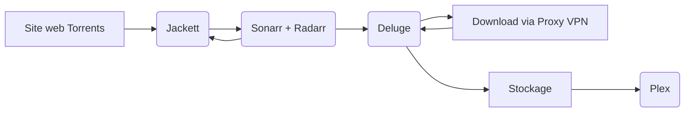

# Docker-bandj

EN COURS - PAS FINI

Présentation de notre projet docker consistant à déployer une plateforme de multimédia entièrement automatisé

Nous aurons dans ce projet docker :
- **Plex** : Gestionnaire de bibliothèques films / séries
- **Deluge** : Client léger et opensource BitTorrent
- **Radarr** : Planificateur de téléchargement de films
- **Sonarr** : Planificateur de téléchargement de séries
- **Jackett** : Proxy et indexeur de liens Torrents

A l'aide de ces 5 services, nous pourrons mettre en application le schéma suivant :

**Jackett** va s'assurer de tenir à jour les liens des sites que nous lui donnons en index ainsi que de communiquer directement avec les sites web en faisant les requêtes demandées par **Sonarr** et **Radarr** qui vont quand à eux, tenir un agenda des films et séries demandé par l'utilisateur afin de les trouver, dans la qualité et la langue demandée, et les télécharger une fois disponible sur les sites de torrent mis en index

Une fois le lien torrent trouvé, il va être envoyé à **Deluge** qui va télécharger ce torrent via son client qui passera par un proxy VPN paramétrer directement sur le service (dans notre cas NordVPN #sponso#AD) 

Ces films/séries seront déposer dans un dossier **/BandJ/downloadsBandJ** perçu par les conteneurs comme **/downloads**
Les films sont dans **/downloads/movies** et les épisodes de séries dans **/downloads/series**
Chaque film ou série aura droit à un dossier propre à son nom

**Plex** va pouvoir récupérer et lire les fichier *.mp4* dans ses dossiers et les afficher dans sa bibliothèque de films et séries
Les utilisateurs pourront alors accéder à leur bibliothèque de n'importe où en se connectant à ce compte Plex et regarder leur film préféré depuis un Google Chromecast ou un PC...

# Inscription Plex

Le premier prérequis à respecter est la création d'un compte Plex qui est obligatoire pour héberger l'instance serveur que l'on va déployer avec Docker. Il faut se rendre sur le site https://www.plex.tv et cliquer sur "Sign Up" en haut à droite.

Après avoir procédé à la création du compte Plex et s'y être connecté, il faut se rendre sur https://www.plex.tv/claim/ afin de générer un token de connexion pour associer le compte au serveur. Pour ce faire, copier le token généré qui s'affiche à l'écran :

**Attention** : le token expire au bout de 4 minutes.

Coller le token dans le fichier "docker-compose.yml" à l'endroit prévu comme indiqué ci-dessous :

# Configuration Plex

http://plex_bandj:32400/

Ouvrir la page web du serveur Plex (http / port 32400). Si la page de configuration ne s'affiche pas automatiquement, se déconnecter du compte et se reconnecter aussitôt.

La page de configuration va s'afficher automatiquement, cliquer sur le bouton "J'ai compris !" pour entamer la configuration du serveur Plex.

Créer deux bibliothèques : une bibliothèque "Films" et une bibliothèque "Séries" et faire pointer respectivement vers les chemins suivants :

# Configuration Deluge

http://deluge_bandj:8112/

Mot de passe par défaut : deluge

Ajouter les plugins "Label" et "Execute" dans les préférences :

Créer deux nouveaux labels pour Sonarr et Radarr :

Ajouter le script de notification Telegram lorsqu'un téléchargement est terminé :

Configurer un proxy VPN (si disponible) :

# Configuration Jackett

http://jackett_bandj:9117/UI/Dashboard

Ajouter plusieurs indexeurs Torrent de type "Public" et récupérer l'API Key en haut de page :

# Configuration Radarr

http://radarr_bandj:7878/activity/queue

Copier chaque lien d'indexeur ajouté dans Jackett (bouton "Copy Torznab feed") et l'ajouter dans Radarr (-> Add indexer - Torznab) ainsi que l'API Key :

# Configuration Sonarr

http://sonarr_bandj:8989/

Faire la même chose que pour Radarr.

# C'est parti pour un test avec Radarr !

Chercher et ajouter un nouveau film sur Radarr :

Le téléchargement se met automatiquement en file d'attente et apparaît dans Deluge :

