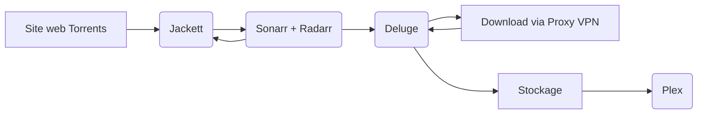

# **Docker-BandJ**

**Présentation du projet Docker de déploiement d'une plateforme multimédia automatisée.**

> Lien GitHub : https://github.com/WaliWalou/docker-bandj

> Lien DockerHub : https://hub.docker.com/repositories/benibee33

***Disclaimer*** *: ce projet n'a pas pour but d'inciter ou encourager le piratage audiovisuel, il entre dans un cadre éducatif et d'apprentissage visant à utiliser Docker de manière plus avancée avec le déploiement d'une infrastructure automatisée de plusieurs conteneurs interconnectés et dépendants.*

Liste des conteneurs :

- **Plex** : Gestionnaire de bibliothèques films / séries.
- **Jackett** : Proxy et indexeur de liens Torrents.
- **Radarr** : Planificateur de téléchargement de films.
- **Sonarr** : Planificateur de téléchargement de séries.
- **Deluge** : Client open-source et léger de téléchargement Torrents.

*// Extra*
- **Tautulli** : Monitoring, stats et graphs pour Plex.
- **Portainer** : Gestionnaire de containers Docker.

---

Le schéma suivant met en évidence le fonctionnement et les liaisons entre les principaux services :

Les conteneurs du projet communiquent entre eux via un réseau interne bridge, l'accès aux interfaces web doit se faire depuis l'hôte Docker.

*Rappel pour déterminer l'IP locale d'un container :*

	docker ps -a
	docker inspect <container_id> | grep IPAddress
 
 ---

**Jackett** va agir en tant qu'API pour traiter les requêtes de **Sonarr** et **Radarr**, leur permettant d'interroger les sources de ce premier par les indexeurs Torrent paramétrés. Ainsi, Sonarr et Radarr bénéficieront d'une médiathèque enrichie de films et séries téléchargeables, avec des options de recherche avancées telles que la qualité du média ou la langue.

Après avoir choisi précédemment des films et séries à récupérer sur Sonarr et Radarr, les torrents trouvés dans la recherche qui sont sélectionnés vont être ajoutés dans le gestionnaire de torrents du client **Deluge**. Celui-ci téléchargera les fichiers en passant par un logiciel ou proxy VPN. Ici en l'occurrence, **NordVPN** est utilisé en tant que proxy *Socks5* pour la réalisation du projet #sponso.

* Les films et séries seront téléchargés par **Deluge** dans un dossier de l'hôte **/BandJ/downloadsBandJ** partagé avec les conteneurs par le répertoire **/downloads**. Les films sont situés dans le sous-répertoire **/downloads/movies** et les séries dans **/downloads/series**.

* Chaque film ou série aura droit à son dossier propre qui sera créé et les noms de fichiers sont normés selon les bonnes pratiques pour être détecté par Plex et associé correctement au bon film ou à la série correspondante.

**Plex Media Server** est l'instance serveur hébergeant la plateforme multimédia, disposant d'une interface graphique pour le *back* et le *front*. Il va scanner les fichiers en temps réel dans les dossiers de destination et les associer aux bonnes catégories de la bibliothèque. Les utilisateurs pourront ainsi accéder à l'interface web de Plex depuis n'importe quelle plateforme (smartphone, navigateur web, AndroidTV..) et lire les films/séries à disposition.

**Tautulli** est un outil de surveillance et statistiques dédié à **Plex Media Server**. Il permet de suivre les activités des utilisateurs, afficher graphiquement des statistiques liées à l'utilisation, les historiques de lecture.. Il est possible de garder un œil sur les performances du serveur Plex et d'assurer que les utilisateurs bénéficient de la meilleure expérience possible en matière de streaming.

**Portainer** est une solution de gestion de conteneurs Docker qui offre une interface graphique conviviale pour simplifier le déploiement, la configuration et la maintenance des applications et services Docker. Portainer permet de gérer tout ce qui est rattaché aux conteneurs: réseaux, volumes, registres et autres ressources Docker, sans avoir besoin de maîtriser les commandes Docker en ligne de commande. En intégrant Portainer au projet projet, on peut gérer et superviser facilement l'ensemble de la stack Plex, Jackett, Sonarr, Radarr, Deluge et Tautulli à partir d'un seul et même tableau de bord.

**Attention**: *ne pas utiliser l'image benibee33/portainer_custom car l'image est buguée et le serveur web n'est de ce fait, pas fonctionnel. C'est pour cette raison que le fichier docker-compose mentionne pour Portainer l'image officielle portainer/portainer-ce:latest à la place.*

Le script de notifications du **chatbot Telegram** permet de recevoir directement une alerte en temps réel sur son application Telegram lorsqu'un téléchargement est terminé. Il s'agit d'un script bash nommé *telegram.sh* situé dans le dossier */tmp/* du conteneur Deluge, exécuté par ce dernier à l'aide du plugin *Execute* du client torrent.

# Inscription Plex et récupération du Token

Le pré-requis obligatoire à respecter est la création d'un compte Plex, nécessaire pour rendre opérationnelle l'instance serveur déployée dans son propre container Docker. Par la même occasion, un token de connexion peut-être généré et être intégré dans le fichier ***docker-compose.yaml*** du projet pour faciliter l'installation initiale de **Plex Media Server** 

- Se rendre sur le site web https://www.plex.tv et cliquer sur le bouton ***Sign Up*** en haut à droite et suivre les indications pour créer un compte Plex.

- Accéder après connexion au compte Plex au lien https://www.plex.tv/claim/ puis copier le token généré manuellement ou avec le bouton ***Copy to Clipboard*** :

**Attention** : comme indiqué dans la capture, le token expire au bout de 4 minutes. Il faudra réitérer cette opération en cas de dépassement du temps imparti.

# Déploiement des containers

-  Sur la machine hôte Docker, télécharger ou cloner le repo GitHub avec la commande **git** depuis un terminal :
			
		git clone https://github.com/WaliWalou/docker-bandj

- Récupérer le token Plex généré précédemment et le coller dans le fichier ***docker-compose.yaml*** du projet :

- *Faculatif* - récupérer les *ChatID* et *Token* du chatbot Telegram et les coller dans le script **telegram.sh** au niveau des variables **TOKEN** et **CHAT_ID**, puis sauvegarder la modification :

- Depuis le terminal, se positionner dans le répertoire racine du projet et entrer la commande ci-dessous pour déployer les conteneurs :

		docker compose up -d

---

**Note**: lors du premier déploiement, une erreur de droits d'accès au répertoire de configuration Plex peut survenir.
--> '***plex_bandj   | OSError: [Errno 13] Permission denied: '/config/Library/Application Support/Plex Media Server/Logs/PMS Plugin Logs***'

- Si l'erreur citée apparaît dans les logs, taper la commande ci-dessous en étant situé dans le répertoire racine du projet :

		sudo chown -R 911:911 ./BandJ/plex/config
	
- Redémarrer ensuite les containers : 

		docker-compose down
		docker-compose up -d

# Configuration Plex

**http://plex_bandj:32400/**

- Accéder à l'interface web du serveur Plex. La page de configuration va s'afficher automatiquement, cliquer sur le bouton ***J'ai compris !*** pour entamer la configuration.

***Note:*** *si la page de configuration ne s'affiche pas automatiquement, se déconnecter du compte et se reconnecter aussitôt.* 

- Depuis l'interface web, créer les deux bibliothèques **"Films"** et  **"Séries"** en les faisant pointer vers leurs chemins respectifs comme indiqué dans la capture ci-dessous : 

# Configuration Jackett

**http://jackett_bandj:9117/UI/Dashboard**

- Cliquer sur le bouton ***Add indexer*** en haut de page pour ajouter plusieurs indexeurs : dans notre cas, il s'agit d'indexeurs Torrent de type **Public**. 

- Cliquer sur le bouton ***Test*** après l'ajout de chaque indexeur pour vérifier si l'accès est effectif :

- Copier les liens des indexeurs ajoutés précédemment via le bouton ***Copy Torznab feed*** puis copier également l'API Key affiché en haut à droite de la page par le bouton bleu situé en face.

*Note:* ces éléments vont être nécessaires pour la prochaine étape de configuration de Radarr et Sonarr.

# Configuration Radarr

**http://radarr_bandj:7878/**

- Cliquer sur le menu ***Settings*** dans le volet gauche et sur le bouton ***Download Clients***.

- Choisir **Deluge** comme logiciel client de téléchargement, déployé dans un conteneur séparé : 

- Depuis la page d'accueil de **Radarr**, cliquer sur l'onglet ***Add indexer***  dans le volet gauche, choisir  ***Torznab*** comme source Torrent et remplir les champ correspondants comme ci-dessous :

# Configuration Sonarr

**http://sonarr_bandj:8989/**

- Accéder à l'interface web de Sonarr et répéter les même étapes effectuées précédemment pour Radarr. Il s'agit exactement de la même interface donc ça ne devrait pas être trop compliqué =)

# Configuration Deluge

**http://deluge_bandj:8112/**

- Accéder à l'interface web de Deluge et entrer le mot de passe **deluge** (par défaut) demandé dans le prompt d'authentification.

- Cliquer sur le menu ***Preferences*** et aller dans l'onglet ***Plugins*** à gauche pour cocher les plugins *Label* et *Execute* :

- Dans la page principale, créer à gauche deux nouveaux labels pour **Sonarr** et **Radarr** en faisant un clic droit :

# Facultatif (notifs Telegram + VPN)

Cette partie va traiter deux éléments facultatifs à intégrer : la réception de **notifications par un chatbot Telegram** et l'intégration d'un **client ou proxy VPN avec Deluge**. 

## - Notifications du chatbot Telegram

- Sur l'interface de **Deluge**, accéder au menu ***Preferences*** et cliquer sur le plugin ***Execute*** à gauche.

- Choisir **"Torrent complete"** dans le champ ***Event*** et indiquer dans le champ ***Command*** le chemin absolu vers le script bash *telegram.sh* qui se trouve dans le dossier */tmp/* au sein du container :

## - Proxy VPN pour Deluge

- Depuis l'interface de Deluge, se rendre dans le menu ***Preferences*** et cliquer à gauche sur l'onglet ***Proxy***. Définir le type de proxy à utiliser (ici *Socks5 Auth* avec NordVPN) et remplir les champs correspondants :

Astuce: pour vérifier si l'intégration du VPN dans Deluge est bien effective, le site https://ipleak.net permet de déterminer l'IP publique retournée par le client VPN lors d'un téléchargement.
 

# C'est parti pour un test avec Radarr !

- La plateforme multimédia est maintenant prête. Pour effectuer un test d'ajout de films, accéder maintenant à l'interface web de Radarr avec un navigateur.

- Dans le champ de recherche, entrer un nom de film puis sélectionner dans les listes déroulantes les valeurs voulues, notamment la qualité du film :

- Attendre que le téléchargement se rajoute automatiquement en file d'attente dans l'onglet **Queue**.

- Se rendre dans l'interface web de **Deluge** et vérifier si le torrent apparaît bien dans la liste, en cours de téléchargement :

- A la fin du téléchargement du torrent avec Deluge, le fichier se retrouve scanné automatiquement par Plex et se retrouve au sein de sa bibliothèque correspondante au sein de l'interface web :

Note : pour un scan automatique lors de l'ajout d'un nouveau fichier, une option doit être cochée dans la configuration de Plex. Cliquer sur le bouton ***Réglages*** en haut à droite (clé à molette) pour accéder aux paramètres à gauche, **Réglages / Bibliothèque** :

- Aperçu de la notification de l'application Telegram reçue sur un smartphone :

# Extras

## Tautulli

**http://tautulli_bandj:8181/**

- Se rendre sur l'interface web de Tautulli et entrer les credentials du compte Plex dans le prompt d'authentification.

***Note:*** il est possible de se connecter à l'interface web via son compte Plex ou directement avec un compte local dédié à Tautulli.

- Indiquer le nom d'hôte du conteneur et le port correspondant puis faire un test :

- Depuis la page d'accueil de Tautulli, parcourir les différents menus pour visualiser les statistiques et graphiques concernant l'utilisation du serveur Plex avec la possibilité d'affiner ou filtrer les résultats:

## Portainer

**https://portainer_bandj:9443**

- Se rendre sur l'interface web de Portainer, suivre les indications de la page et créer un compte d'accès administrateur.

- Après connexion, sauter la partie configuration de l'environnement Docker utilisé, Portainer détecte par lui-même qu'il fonctionne dans un container.

---

Enjoy !
