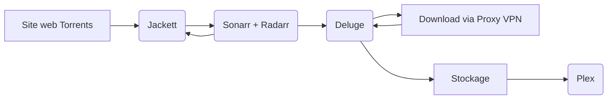

# Docker-bandj

Présentation du projet Docker consistant à déployer une plateforme de multimédia automatisée.

Dans ce projet on retrouve notamment :
- **Plex** : Gestionnaire de bibliothèques films / séries
- **Deluge** : Client léger et opensource BitTorrent
- **Radarr** : Planificateur de téléchargement de films
- **Sonarr** : Planificateur de téléchargement de séries
- **Jackett** : Proxy et indexeur de liens Torrents

Extra :
- **Tautulli** : Monitoring, stats et graphs pour Plex
- **Portainer** : Gestionnaire de containers Docker

Le schéma suivant met en évidence l'interconnexion et le fonctionnement entre les 5 services principaux :

**Jackett** va s'assurer de tenir à jour les liens des sites que nous lui donnons en index ainsi que de communiquer directement avec les sites web en faisant les requêtes demandées par **Sonarr** et **Radarr** qui vont quand à eux, tenir un agenda des films et séries demandé par l'utilisateur afin de les trouver, dans la qualité et la langue demandée, et les télécharger une fois disponible sur les sites de torrent mis en index

Une fois le lien torrent trouvé, il va être envoyé à **Deluge** qui va télécharger ce torrent via son client qui passera par un proxy VPN paramétré (dans notre cas NordVPN #sponso#AD) 

Ces films/séries seront déposer dans un dossier **/BandJ/downloadsBandJ** perçu par les conteneurs comme **/downloads**
Les films sont dans **/downloads/movies** et les épisodes de séries dans **/downloads/series**
Chaque film ou série aura droit à un dossier propre à son nom

**Plex** va pouvoir récupérer et lire les fichier *.mp4* dans ses dossiers et les afficher dans sa bibliothèque de films et séries
Les utilisateurs pourront alors accéder à leur bibliothèque de n'importe où en se connectant à ce compte Plex et regarder leur film préféré depuis un Google Chromecast ou un PC...

**Extra :**

**Tautulli** est un outil de surveillance et d'analyse dédié à **Plex Media Server**. Il permet de suivre les activités des utilisateurs, les statistiques d'utilisation, les historiques de lecture, et bien plus encore. Grâce à Tautulli, il est possible de garder un œil sur les performances du serveur Plex et d'assurer que les utilisateurs bénéficient de la meilleure expérience possible en matière de streaming.

**Portainer** est une solution de gestion de conteneurs Docker qui offre une interface graphique conviviale pour simplifier le déploiement, la configuration et la maintenance des applications et services Docker. Portainer permet de gérer tout ce qui est rattaché aux conteneurs : réseaux, volumes, registres et autres ressources Docker, sans avoir besoin de maîtriser les commandes Docker en ligne de commande. En intégrant Portainer au projet projet, on peut gérer et superviser facilement l'ensemble de la stack Plex, Jackett, Sonarr, Radarr, Deluge et Tautulli à partir d'un seul et même tableau de bord.

Attention, ne pas utiliser l'image benibee33/portainer_custom car l'image est bugué et le serveur web n'est pas fonctionnel. C'est pour cette raison que le fichier docker-compose appelle directement l'image officielle portainer/portainer-ce:latest

**Extra plus :** 

**ChatBot Telegram** permet de recevoir directement une notification par l'application Telegram lorsqu'un téléchargement est terminé : un script bash a été intégré pour être exécuté par Deluge.

# Inscription Plex

Le premier prérequis à respecter est la création d'un compte Plex qui est obligatoire pour héberger l'instance serveur que l'on va déployer avec Docker. Il faut se rendre sur le site https://www.plex.tv et cliquer sur "Sign Up" en haut à droite.

Après avoir procédé à la création du compte Plex et s'y être connecté, il faut se rendre sur https://www.plex.tv/claim/ afin de générer un token de connexion pour associer le compte au serveur. Pour ce faire, copier le token généré qui s'affiche à l'écran :

**Attention** : le token expire au bout de 4 minutes.

Coller le token dans le fichier "docker-compose.yml" à l'endroit prévu comme indiqué ci-dessous :

# Déploiement des containers

Pour déployer la stack, télécharger ou cloner avec git l'ensemble de l'arborescence.

Lancer ensuite le déploiement : **docker compose up -d**

**Note** : aucun container n'est mappé sur l'hôte, les containers communiquent entre eux via un réseau interne bridge

Pour déterminer l'IP d'un container :
docker ps -a
docker inspect <container_id> | grep IPAddress

# Configuration Plex

http://plex_bandj:32400/

Ouvrir la page web du serveur Plex : si la page de configuration ne s'affiche pas automatiquement, se déconnecter du compte et se reconnecter aussitôt. La page de configuration va s'afficher automatiquement, cliquer sur le bouton "J'ai compris !" pour entamer la configuration du serveur Plex.

Créer deux bibliothèques : une bibliothèque "Films" et une bibliothèque "Séries" et faire pointer respectivement vers les chemins suivants :

# Configuration Deluge

http://deluge_bandj:8112/

Mot de passe par défaut : **deluge**

Ajouter les plugins "Label" et "Execute" dans les préférences :

Créer deux nouveaux labels pour Sonarr et Radarr :

Indiquer l'exécution du script de notification Telegram lorsqu'un téléchargement est terminé :

Copier/coller son chat ID et Token Telegram dans le script **telegram.sh** :

Configurer un proxy VPN (si disponible) :

# Configuration Jackett

http://jackett_bandj:9117/UI/Dashboard

Ajouter plusieurs indexeurs Torrent de type "Public" et récupérer l'API Key en haut de page :

# Configuration Radarr

Ajouter un logiciel client de téléchargement Torrent (Deluge ici en l'occurence) :

http://radarr_bandj:7878/activity/queue

Copier chaque lien d'indexeur ajouté dans Jackett (bouton "Copy Torznab feed") et l'ajouter dans Radarr (-> Add indexer - Torznab) ainsi que l'API Key :

# Configuration Sonarr

http://sonarr_bandj:8989/

Répéter les même étapes effectuées précédemment pour Radarr

# C'est parti pour un test avec Radarr !

Chercher et ajouter un nouveau film sur Radarr :

Le téléchargement se met automatiquement en file d'attente et apparaît dans Deluge :

Après la fin du téléchargement Torrent avec Deluge, le fichier est scanné par Plex et se retrouve au sein de sa bibliothèque correspondante dans l'interface de Plex :

Notification Telegram reçue :

# Extra avec Tautulli

Tautulli génère automatiquement des statistiques et graphiques concernant l'utilisation du serveur Plex, avec la possibilité d'affiner ou filtrer les résultats.

# Extra Plus avec Portainer

https://portainer_bandj:9443

