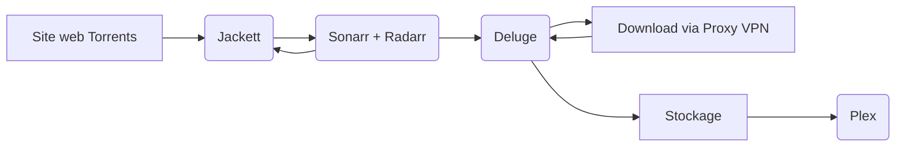

# Docker-bandj

Présentation de notre projet docker consistant à déployer une plateforme de multimédia entièrement automatisé

Nous aurons dans ce projet docker :
- **Plex** : Gestionnaire de bibliothèques films / séries
- **Deluge** : Client léger et opensource BitTorrent
- **Radarr** : Planificateur de téléchargement de films
- **Sonarr** : Planificateur de téléchargement de séries
- **Jackett** : Proxy et indexeur de liens Torrents

A l'aide de ces 5 services, nous pourrons mettre en application le schéma suivant :

**Jackett** va s'assurer de tenir à jour les liens des sites que nous lui donnons en index ainsi que de communiquer directement avec les sites web en faisant les requêtes demandées par **Sonarr** et **Radarr** qui vont quand à eux, tenir un agenda des films et séries demandé par l'utilisateur afin de les trouver, dans la qualité et la langue demandée, et les télécharger une fois disponible sur les sites de torrent mis en index

Une fois le lien torrent trouvé, il va être envoyé à **Deluge** qui va télécharger ce torrent via son client qui passera par un proxy VPN paramétrer directement sur le service (dans notre cas NordVPN #sponso#AD) 

Ces films/séries seront déposer dans un dossier **/BandJ/downloadsBandJ** perçu par les conteneurs comme **/downloads**
Les films sont dans **/downloads/movies** et les épisodes de séries dans **/downloads/series**
Chaque film ou série aura droit à un dossier propre à son nom

**Plex** va pouvoir récupérer et lire les fichier *.mp4* dans ses dossiers et les afficher dans sa bibliothèque de films et séries
Les utilisateurs pourront alors accéder à leur bibliothèque de n'importe où en se connectant à ce compte Plex et regarder leur film préféré depuis un Google Chromecast ou un PC...
